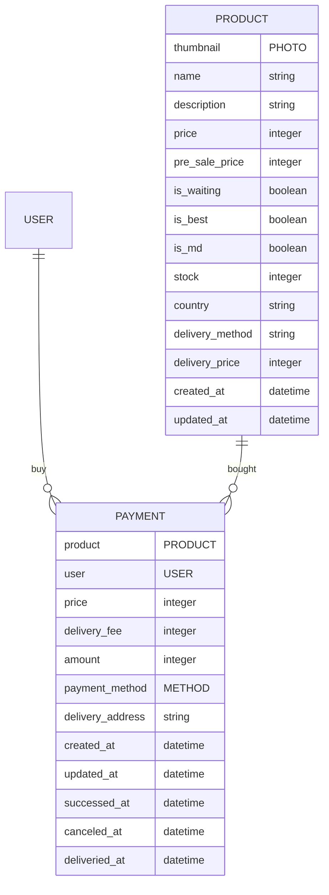

# :green_apple: store-management-system

Django, djangoreatframework로 구축한 친환경 농가 API 개발

## 목차

- [:green_apple: store-management-system](#green_apple-store-management-system)
  - [목차](#목차)
  - [:family: 멤버소개](#family-멤버소개)
  - [:notebook_with_decorative_cover: 프로젝트 요구사항](#notebook_with_decorative_cover-프로젝트-요구사항)
  - [:computer: ER Diagram](#computer-er-diagram)
    - [payments](#payments)
    - [products](#products)
    - [users](#users)

## :family: 멤버소개

| 이름   | Github                        | Email                 | Blog                        |
| ------ | ----------------------------- | --------------------- | --------------------------- |
| 이찬행 | https://github.com/2chanhaeng | 2chanhaeng@gmail.com  | https://chomu.dev/          |
| 이호진 | https://github.com/HoJin9622  | kiss0104040@gmail.com | https://velog.io/@hojin9622 |
| 김동현 | https://github.com/xxddongxx  | hyeon2187@gmail.com   | -                           |

## :notebook_with_decorative_cover: 프로젝트 요구사항

- 기존 운영서비스(스토어)의 Backend 개발
- 기능 구현을 위한 DB 생성 : 회원관리, 상품관리, 결재관리, 주문내역 등
- DB에 정보 입력, 수정, 조회, 삭제를 위한 REST API 개발
- 정보 입력, 수정 시 데이터 형식의 유효성을 검사
- REST API에서 벗어난 Param 또는 요청오류에 대한 응답처리
- 유저는 이용자, 관리자로 나누어져 있으며 상품 및 결재, 주문은 관리자만 입력, 수정, 삭제 가능,
  이용자는 회원가입, 결재, 주문을 제외하고 조회 권한만 허용

## :computer: ER Diagram

### payments

- 결제 모델
  - `id`: 프라이머리 키로 사용될 아이디
  - `product`: 상품
  - `user`: 이용자
  - `price`: 상품가격
  - `delivery_fee`: 배송비
  - `amount`: 최종결제금액 (상품가격 + 배송비)
  - `payment_method`: 결제수단
  - `delivery_address`: 배송지 주소 및 메모
  - `created_at`: 생성 시간
  - `updated_at`: 취소 시간
  - `successed_at`: 결제 성공 시간 (null이면 결제 실패)
  - `canceled_at`: 결제 취소 시간 (null이면 결제 유지 중)
  - `deliveried_at`: 배송 완료 시간 (null이면 배송 미완료)

### products

- 제품 모델
  - thumbnail: 썸네일
  - name: 상품명
  - description: 상품 설명
  - price: 가격
  - pre_sale_price: 세일 전 가격
  - is_waiting: 판매 대기 여부
  - is_best: 베스트 상품 여부
  - is_md: MD 상품 여부
  - stock: 재고
  - country: 원산지
  - delivery_method: 배송방법
  - delivery_price: 배송비

### users

- 사용자 모델
  - id: 프라이머리키로 사용될 아이디
  - user_id: 로그인 아이디
  - password: 암호화된 비밀번호
  - user_name: 사용자 이름
  - email: email
  - address: 사용자 주소
  - date_joined: 회원가입 일
  - last_login: 마지막 로그인
  - is_superuser: 모든 권한 활성 여부
  - is_staff: admin 점속 가능 여부
  - is_active: 계정 활성 여부
