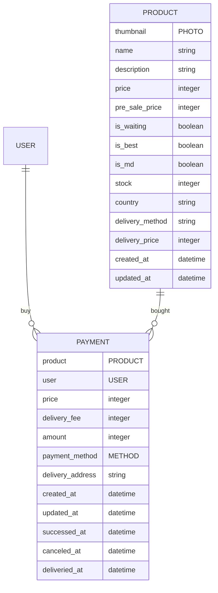

# store-management-system
원티드 백엔드 프리온보딩 백엔드 5차 1주차 기업과제 Fruttie C팀

# 앱

## payments
- 결제 모델
  - `id`: 프라이머리 키로 사용될 아이디
  - `product`: 상품
  - `user`: 이용자
  - `price`: 상품가격
  - `delivery_fee`: 배송비
  - `amount`: 최종결제금액 (상품가격 + 배송비) 
  - `payment_method`: 결제수단
  - `delivery_address`: 배송지 주소 및 메모
  - `created_at`: 생성 시간
  - `updated_at`: 취소 시간
  - `successed_at`:  결제 성공 시간 (null이면 결제 실패)
  - `canceled_at`:  결제 취소 시간 (null이면 결제 유지 중)
  - `deliveried_at`:  배송 완료 시간 (null이면 배송 미완료)

## products
- 제품 모델
  - thumbnail: 썸네일
  - name: 상품명
  - description: 상품 설명
  - price: 가격
  - pre_sale_price: 세일 전 가격
  - is_waiting: 판매 대기 여부
  - is_best: 베스트 상품 여부
  - is_md: MD 상품 여부
  - stock: 재고
  - country: 원산지
  - delivery_method: 배송방법
  - delivery_price: 배송비

## users
- 사용자 모델
