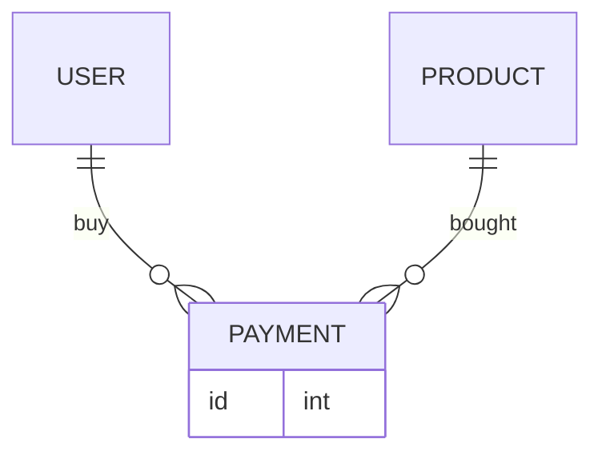

# store-management-system
원티드 백엔드 프리온보딩 백엔드 5차 1주차 기업과제 Fruttie C팀

# 앱

```mermaid
erDiagram
PAYMENT{
    id int
}
PRODUCT{
}
USER{
}
USER ||--o{ PAYMENT : buy
PRODUCT ||--o{ PAYMENT : bought
```

## payments
- 결제 모델
  - `id`: 프라이머리 키로 사용될 아이디

## products
- 제품 모델

## users
- 사용자 모델
